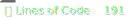
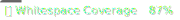
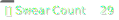

# Template Repository

[](../../commits/main)
[](../../contributors)
[](../../actions/workflows/build_with_badges.yml)
[](../..)
[](../..)
[](../..)
[](../..)
[](../..)
[](../..)
[](../..)
[](../../issues)
[](../../pulls)
[](../..)
[](../../issues)
[](../..)
[](../../actions/workflows/build_with_badges.yml)
[](../..)
[](../..)
[](../..)
[](../..)
[](../..)

Insert quick blurb of what this repository is for.

## Table of Contents
- [Table of Contents](#table-of-contents)
- [Overview](#overview)
- [Technologies](#technologies)
- [Getting Started](#getting-started)
- [Usage](#usage)

## Overview

I love badges, and I love GitHub Actions. This repository is a template repo to slap badges everywhere. It is a work in progress, and I will be adding more badges as I think of them. The end goal is at least 5 rows of solid badges 🦡. If you have any ideas, please open an issue and let me know. Not having 5 rows of badges is a sin, and I will not stand for it.

## Technologies

This project is created with:

- [GitHub Actions](https://github.com/features/actions)
- [BASH](https://www.gnu.org/software/bash/)
- [CODEQL](https://codeql.github.com/)
  
## Getting Started

This repo just makes sick badges, but for most repos, use the following:

Clone the Repo \
```git clone https://github.com/Pop101/____``` \
Enter the repo and Install requirements \
```cd ____ && sudo python3 -m pip install -r requirements```

## Usage

Revel in badges.
